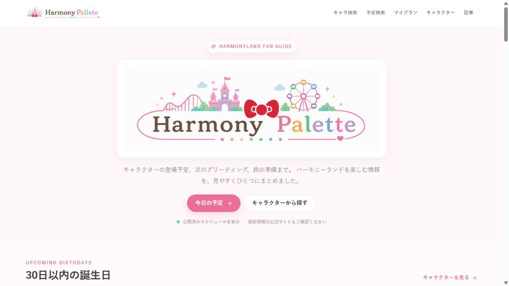
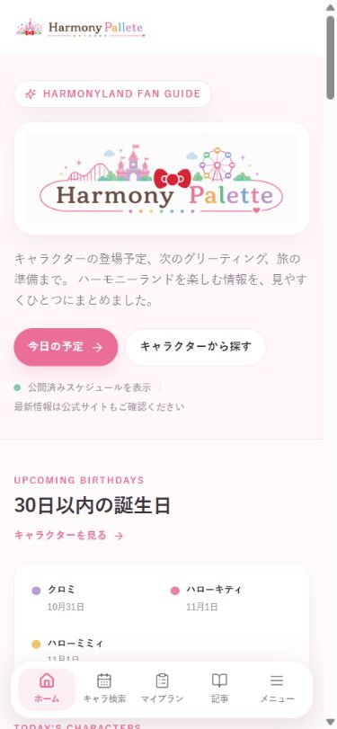
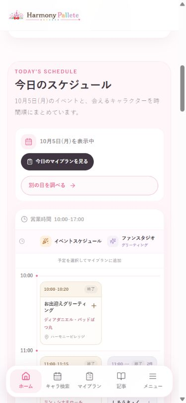

# TOP構成の検討案：独自記事の発見と当日の予定確認を両立する

検討日：2026年10月5日。対象：https://harmonypalette.jp/ 。アプリ実装・公開データ・広告設定は変更していない。以下のレイアウト・高さ・改善効果は提案であり、実装後の検証結果ではない。

## 推奨案

コンパクトにした導入のすぐ下で「今日の確認」と「現地で分かったこと」を紹介する。予定・検索・マイプランへの入口を保ち、独自記事が長い予定表に埋もれないようにする。

| 順序 | 内容 | 編集・操作の方針 |
| --- | --- | --- |
| 1 | ロゴ、短いサイト説明、目的別の入口 | 既存のイラスト付きロゴを保ち、サイズと余白を抑える。「今日の予定」「キャラ検索」「マイプラン」をすぐ使える位置へ。非公式であることと実際の来園経験に基づくことを短く伝える。 |
| 2 | 今日の確認 | 日付・営業状況・営業時間と、進行中／次の予定を2〜3枠。全件表示への直接リンクを置く。休園日、未公開、通信エラー、全予定終了を区別する。短い要約は詳細を置き換えない。 |
| 3 | 現地で分かったこと：選定記事2件 | 小さな写真、何が分かるか1〜2文、取材日または情報確認日、記事へのリンク。更新順だけでなく独自性と利用価値で選ぶ。 |
| 4 | 今日の詳細 | 今日会えるキャラクターと全件の予定表を引き続き表示。マイプランへの追加操作、別の日の検索を維持。全件を初期表示し、アコーディオンや記事／予定の切り替えタブに閉じ込めない。 |
| 5 | 目的別ガイドと最新の来園レポ | 初来園、グリーティング、子連れなど、実際にある記事へ案内する。最新記事3件は残し、上部の選定記事と役割を分ける。 |
| 6 | 誕生日情報・運営者・Instagram | 誕生日は短い帯で紹介し、上部にも移動リンクを残す。運営者紹介は2〜3文とaboutへのリンク。Instagramは記事・予定より下に置く。 |

PCでは2と3を並列にし、その下に横幅のある全件予定表を置く。スマートフォンでは2→3→4の順にする。横スクロールのカルーセルを使わず、選定記事2件をそのまま見せる。上部の誕生日リンクは現在の誕生日目的の利用を支える。

説明文の案：「実際にハーモニーランドへ通う家族が、来園で分かったことと、今日の予定をまとめる非公式ファンサイトです。」実際の運営者紹介・取材記事に根拠がある範囲で使用する。

## 上部で紹介する記事

1. [10月3日の来園レポ](https://harmonypalette.jp/articles/harmonyland-report-2026-10-03)：表示見出し案「マイプランで実際に回った一日」。本文には作成したプランと時系列の実績があり、整理券・有料券・移動の使い分けが記載されている。機能と取材記事を結びつけられる。取材日10/3と公開日10/5を区別する。
2. [ハーモニーパス記事](https://harmonypalette.jp/articles/harmonyland-fan-studio-harmony-pass-guide)：表示見出し案「無料整理券とハーモニーパス、どう使い分ける？」。利用経験と選び方があり、来園前に判断できる。条件・料金は記事の確認日と公式案内を参照する。

本文の単純な抜粋ではなく「何の疑問を解決する記事か」を説明する。本文にない体験や成果をカード用に作らない。季節限定・開催終了の記事はその状態を示し、現在の案内と区別する。

## 比較した案

| 案 | 良い点 | 懸念 | 判断 |
| --- | --- | --- | --- |
| 最新記事3件を丸ごと上へ移動 | 変更範囲が小さい | 既存の大きな記事カードをスマホで3件並べると予定表がさらに遠くなる。最新順だけでは独自性を選べない。 | 第二候補 |
| 今日の確認＋選定記事2件＋全件予定表 | 記事と機能の価値を上部で伝え、詳細への1タップ導線も維持できる | 要約が増えるため、情報の重複と画面の高さを管理する必要がある | 推奨 |
| 記事中心のTOPにして予定を別ページへ集約 | 編集コンテンツの主張が強い | 現在TOPで予定を見たりマイプランに追加したりする人にページ移動を増やす | 今回の使い勝手の条件に合わない |

## 操作性を下げないための受け入れ条件

- スマホ390×844の初期表示で、今日の予定・キャラ検索・マイプランへの入口が見える。
- 「今日の予定」は引き続き1タップで全件予定表へ移動できる。固定ヘッダーに見出しが隠れない。
- 同じ日・同じデータ・同じ文字サイズで、今日の予定表の見出しを現状の約1,202pxより下に押し下げない。これは設計目標であり未検証。
- 選定記事の先頭はスマホで1スクロール以内に見つかる構成を目指す。PCは最初の画面内で今日の確認と選定記事の入口を見せる。
- 全件予定表・キャラクター名・追加操作を保持する。主要操作をタブや横スクロールの裏に置かない。
- 文字を小さくして高さを減らさない。主要ボタンは44px程度の押せる領域を確保し、文字拡大時も固定高で本文を切らない。
- 誕生日の上部入口、現在のモバイル下部ナビ、検索の動線を保持する。
- 実装後は予定到達のタップ数・到達時間と、選定記事クリックを比較する。現時点では実利用の分析値やユーザーテスト結果はない。

## AdSenseとの関係

[Googleの不承認時の説明](https://support.google.com/adsense/answer/81904?hl=ja)は、独自性のある充実した内容と分かりやすいナビゲーションを求め、サイト全体が審査対象と説明している。[複製コンテンツのポリシー](https://support.google.com/publisherpolicies/answer/11190248?hl=ja)も、他の情報を使う場合の独自の説明・編集・付加価値を重視している。

この案の狙いは、既にある取材記事と便利な予定確認の両方を見つけやすくすること。「記事を上へ移すと合格する」という公式ルールは確認できず、TOPの並べ替えだけで審査通過を保証できない。既存記事の正確性・独自性・利用価値を整える作業も引き続き必要。

## 今回確認した画面と状態

新しく撮影したスクリーンショットを保存後に開いて確認した。測定値は公開ページのDOMから取得し、スクロール前後の状態を確認した。

1. PC入口（CSS viewport 1280×720）：今日の予定とキャラクター検索の入口は明確。ヒーローは540px高く、最初の画面では記事の内容を判断できない。記事発見に改善余地あり。

2. スマホ入口（CSS viewport 390×844）：下部ナビが機能への入口を支えている。ヒーローは444px。誕生日情報の後に今日のキャラクター・予定が続き、最新記事は長い予定表の後にある。記事発見に改善余地あり。

3. スマホの「今日の予定」リンク：1タップで同ページの全件予定表へ移動した。見出しは画面上端から約165pxで隠れていない。この導線は良好で維持する。

| 見出し | PCの上端から | スマホの上端から |
| --- | ---: | ---: |
| 30日以内の誕生日 | 677px | 572px |
| 今日会えるキャラクター | 886px | 858px |
| 今日のスケジュール | 1,159px | 1,202px |
| 最新記事 | 3,790px | 3,977px |

PC・スマホともページ全体の横はみ出しは観測されなかった。淡い補助テキストや予定表の小さい文字について、縮小時の読みやすさを悪化させないことが設計上の注意点。コントラスト比、キーボード操作、スクリーンリーダー、文字拡大時の全状態は今回未検証であり、アクセシビリティ適合を確認したものではない。AdSenseの個別審査記録と流入別・端末別の利用分析も未確認。

既存ロゴの扱い、今日の予定への直接リンク、マイプラン追加は既存の構造を尊重した提案。Product Design保存コンテキストは存在しなかったため、現在の公開画面・リポジトリ・ユーザーの使い勝手の条件を基準に検討した。
